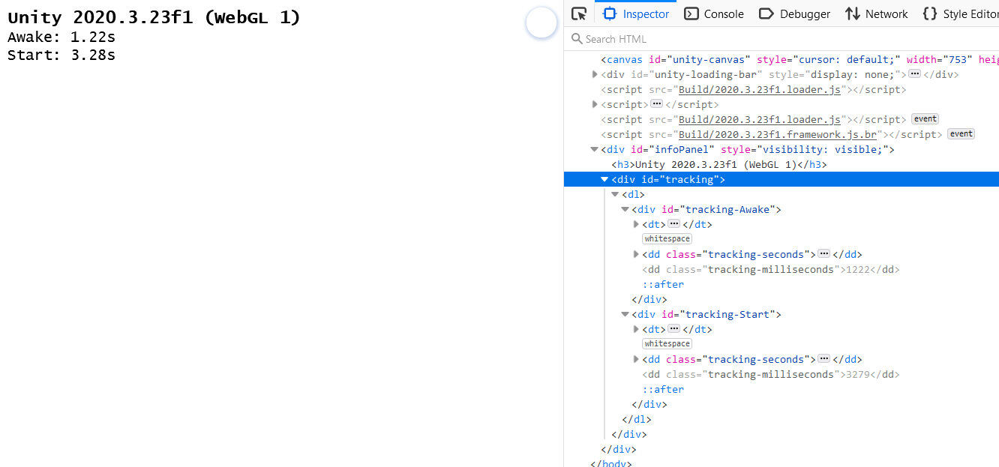

# Selenium Loading Tracker

*Measure loading times of predefined divs with selenium webdriver*

[](../../releases) [](https://dotnet.microsoft.com/download/dotnet/6.0)

## Description

The program opens a website a defined number of times and looks out for specified divs, that are set from the called website. This project is used in [UnityWebGL-LoadingTest](https://github.com/JohannesDeml/UnityWebGL-LoadingTest) to track the average time it takes until Start and Awake are called on Unity's side.

## Usage
The website you want to track needs to have certain tracking structure. That is, a `#tracking` div, in which all `#tracking-{name}` values can be found. Inside  `#tracking-{name}` there needs to be another `.tracking-milliseconds` entry that contains the number of milliseconds you want to pass there. Normally, you will set this to `performance.now()`. 



This gives a very high flexibility on what you want to track, since it can be easily triggered from the client, no matter in which environment you are.

#### Command-line Options (`./SeleniumLoadingTracker --help`)
```
Usage:
  SeleniumLoadingTracker [options]
Options:
  --url <url>                            Target url to test loading time on
                                         [default:
                                         https://deml.io/experiments/unity-webgl
                                         /2020.3.23f1]
  --headless                             Headless mode is used for CI builds
                                         without an actual display [default:
                                         False]
  --verbose                              Use verbose output from browser, helps
                                         with debugging [default: False]
  --tracking-points <tracking-points>    Div id tracking points separated by
                                         spaces [default: Awake Start]
  --warmup-runs <warmup-runs>            Number of runs up front to load the
                                         website data [default: 2]
  --measurement-runs <measurement-runs>  Number of runs to measure the loading
                                         times after warmup [default: 10]
  --website-culture-code                 Culture used on the website to create
  <website-culture-code>                 the number strings [default: en-US]
  --version                              Show version information
  -?, -h, --help                         Show help and usage information
```

## License

[MIT](./LICENSE)